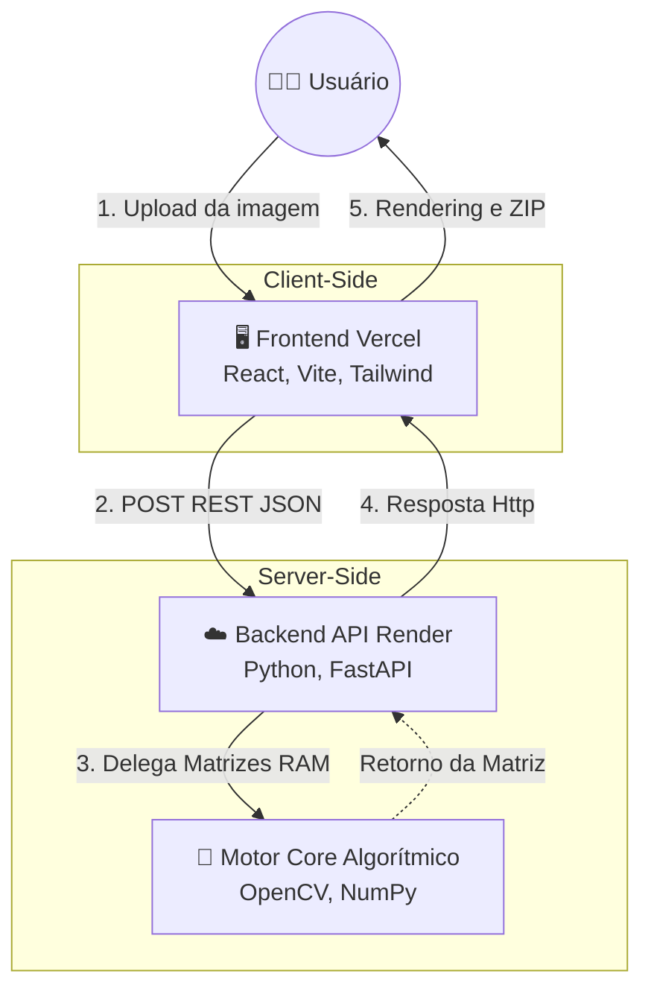

# 🎨 PDI Studio

Um sistema interativo completo para **Processamento Digital de Imagens (PDI)**, desenvolvido com foco acadêmico e didático. O projeto une a performance matricial do OpenCV no backend com uma interface rica, reativa e moderna construída em React.

## 🚀 O Projeto

Este software foi desenvolvido como projeto da disciplina de Processamento Digital de Imagens ministrada pela professora Marta Bez na Universidade Feevale (https://www.feevale.br/). O grande diferencial do PDI Studio é o seu **Exportador Acadêmico**: além de processar as imagens em tempo real na tela, o sistema permite baixar um `.zip` contendo a imagem original, a imagem resultante e um arquivo `algoritmo_utilizado.py`, que explica a fundamentação teórica e demonstra a implementação matemática do algoritmo em **Python Puro** (usando o que foi aprendido nas aulas, laços de repetição, fórmulas matemáticas e matrizes).

## 🛠️ Funcionalidades Implementadas

* **Operações Pontuais:** Conversão para Tons de Cinza (Grayscale), Limiarização (Threshold), Controle de Brilho e Contraste.
* **Filtros Espaciais:** Suavização por Média (Blur), Filtro de Mediana, Passa-Baixa (Gaussiano) e Passa-Alta (Detecção de Bordas via Máscaras de Sobel).
* **Transformações Geométricas:** Translação nos eixos X e Y, Rotação (em graus), Escala (Zoom in/out) e Espelhamento (Horizontal e Vertical).
* **Morfologia Matemática:** Erosão e Dilatação com controle dinâmico do tamanho do Elemento Estruturante (*Kernel Size*) e Iterações.

## 🏗️ Arquitetura de Microsserviços

O projeto foi construído separando completamente a camada visual do motor de processamento:

* **Frontend (O Rosto):** Construído com React, TypeScript, Vite, TailwindCSS e ícones Lucide. Gerencia o estado da imagem e a interface responsiva.
* **Backend (O Cérebro):** Construído com Python e FastAPI. Utiliza a biblioteca `opencv-python-headless` para processamento rápido de matrizes no servidor, recebendo e devolvendo arrays de bytes em milissegundos.

## 🌍 Acesso ao Projeto (Live)

O PDI Studio está hospedado em uma arquitetura de nuvem (Microsserviços):
* **Frontend (Aplicação Web):** https://projeto-pdi.vercel.app/
* **Backend (API Python):** Hospedado no Render (Serviço Web Independente)

*Nota: Como o backend utiliza a camada gratuita do Render, o primeiro processamento de imagem pode levar cerca de 50 segundos para "acordar" o servidor. Os processamentos subsequentes serão instantâneos.*

## ⚙️ Como executar localmente (Para Desenvolvimento)

Caso deseje rodar o projeto em sua própria máquina:
Certifique-se de ter o Node.js e o Python 3 instalados na sua máquina.

**1. Backend (Terminal 1 - Python/FastAPI):**
```bash
cd backend
python -m venv venv
source venv/bin/activate  # (No Windows: venv\Scripts\activate)
pip install -r requirements.txt
uvicorn main:app --reload
```

**2. Frontend (Terminal 2 - React/Vite):**
```bash
cd frontend
npm install
npm run dev
```

O projeto estará rodando em algum link como http://localhost:5173


## 🏗️ Arquitetura do Sistema

O **PDI Studio** foi projetado utilizando uma arquitetura moderna de microsserviços (Decoupled Architecture), separando as responsabilidades de interface (Client-Side) e processamento matricial pesado (Server-Side).



### 🔄 Fluxo de Dados (Data Flow)

1. **Input:** O usuário carrega uma imagem na interface em React.
2. **Transferência:** O Frontend empacota os parâmetros e os dados da matriz, disparando um POST assíncrono para a API hospedada na Render.
3. **Validação:** A API (FastAPI) escuta a rota, confere os argumentos matemáticos (como *tamanho do Kernel* e *Limiar*) e despacha para o motor de processamento central.
4. **Processamento (Core):** Os algoritmos de Visão processam a matriz estritamente em memória RAM alavancando alta performance.
5. **Retorno:** O Backend transcreve a matriz resultante e devolve para o cliente.
6. **Entrega:** O Frontend re-hidrata a imagem no navegador e gera o ZIP Dinâmico para avaliação, injetando as docstrings com a teoria correspondente na versão de código nativa e crua.
